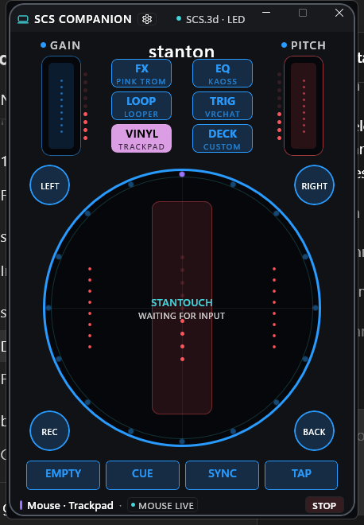
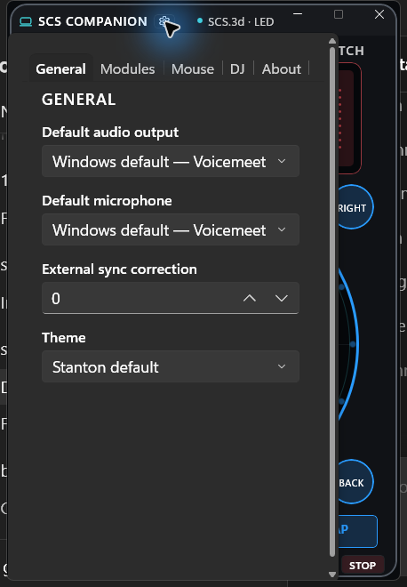
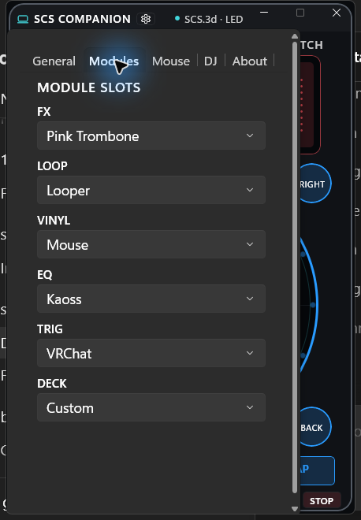
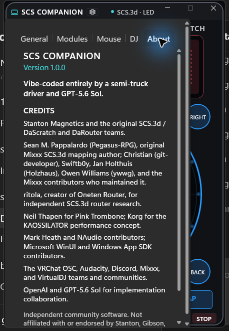
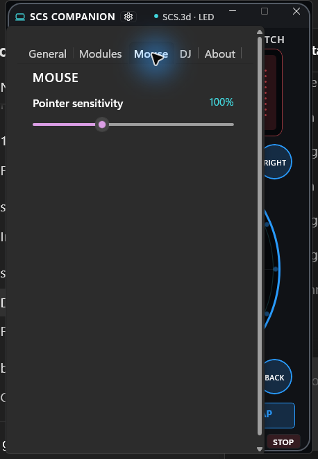
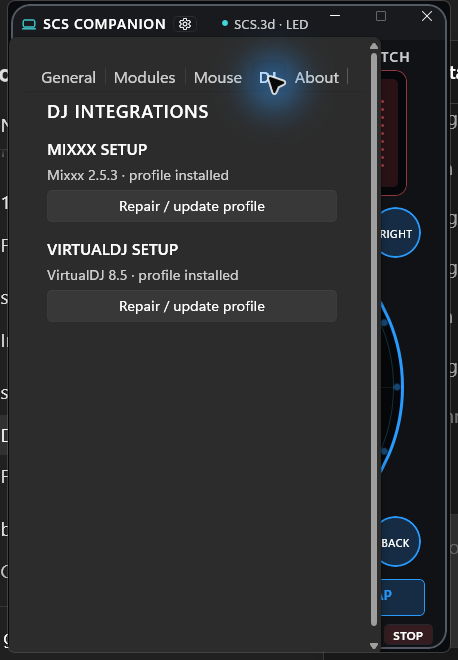

# SCS Companion



SCS Companion gives the discontinued Stanton SCS.3d / DaScratch a new life as a lightweight, standalone Windows control surface. It connects directly to the controller's standard MIDI endpoints, translates its controls into useful desktop actions, and drives its red, blue, and purple LEDs—no DaRouter installation required.

> Vibe-coded by a semi-truck driver while driving **[safely]**, with GPT-5.6 Sol.

## Download

The [latest GitHub release](https://github.com/bingbongs/SCS-Companion/releases/latest) includes two x64 Windows builds:

- `SCSCompanion-Setup-1.0.0-win-x64.exe` — per-user installer with Start menu and optional desktop shortcuts.
- `SCSCompanion-Portable-1.0.0-win-x64.zip` — extract anywhere and run `SCSCompanion.exe`.

Both builds are self-contained. Windows may display a SmartScreen warning because the 1.0 installer is not code-signed.

## What it does

- Connects directly to an `SCS.3d` MIDI input and output.
- Mirrors controller input, active banks, levels, and latched states on the application and hardware LEDs.
- Assigns any available module to each of the six printed hardware mode buttons.
- Remembers module assignments, themes, audio devices, synchronization correction, sensitivity, looper content, and game high scores per Windows user.
- Provides a compact device-shaped WinUI interface designed for narrow and ultrawide desktop layouts.
- Stops and neutralizes held mouse, MIDI, OSC, keyboard, and audio state when routing is paused or the module changes.

## Modules

| Module | Purpose |
| --- | --- |
| **DJ** | Cycles software-specific utility layouts for Serato, Mixxx, VirtualDJ, Traktor, rekordbox, and djay Pro. Bundled Mixxx and VirtualDJ profiles can be installed from Settings. |
| **Media** | Windows output level, playback transport, microphone level, and microphone mute. |
| **Productivity** | Windows, browser, meeting, and streaming shortcuts designed to complement a keyboard. |
| **Looper** | Four independently sized, tempo-synchronized microphone loops with overdub, undo, quantization, tap/estimated BPM, punch effects, live effects, and persistent sessions. |
| **VRChat** | Avatar-independent native OSC movement, look, jump, run, voice, menu, use, grab, radial-menu pointer, and precision controls for Desktop and PC VR. |
| **Mouse** | Directional trackpad and rotary trackball behavior, scrolling, mouse buttons, and controller-action macro recording/playback. |
| **Kaoss** | Scale-locked touch synthesis, built-in patches, gate arpeggiation, hold, tap tempo, and drag-and-drop WAV/MP3/FLAC/OGG/AIFF sample performance. |
| **Audacity** | Recording, playback, pause, stop, undo/redo, and zoom shortcuts for use alongside the normal mouse and keyboard. |
| **Discord** | Voice-chat mute, deafen, navigation, search, dismiss, and output-level controls. |
| **Simon** | Infinite four-pad memory game with hardware light sequences, increasing difficulty, lose feedback, and persistent high score. |
| **Pink Trombone** | Native low-latency glottal/formant vocal-tract instrument with tongue, mouth, pitch, nasal, hold, and voice-character controls. |
| **Custom** | Reserved user profile banks for the growing mapping editor. |

## Interface

The main faceplate follows the physical controller so MIDI input is immediately understandable. The settings flyout stays compact and separates general, module assignment, mouse, DJ integration, and attribution pages.

| Default faceplate | General settings |
| --- | --- |
|  |  |

| Module assignments | About and credits |
| --- | --- |
|  |  |

| Mouse settings | DJ integrations |
| --- | --- |
|  |  |

## Requirements

- Windows 10 or Windows 11, x64.
- Stanton SCS.3d / DaScratch connected over USB.
- VRChat OSC enabled for the VRChat module.
- The target application installed for application-specific shortcut/profile modules.

The controller is discovered by MIDI endpoint name. A custom driver and DaRouter are not required.

## Settings and local data

Settings and captures are stored under `%LOCALAPPDATA%\SCSCompanion`. The app follows the Windows default input and output until a specific endpoint is selected. Looper sessions are saved locally and pause when the Looper module is not active.

## DJ profile setup

Settings → DJ can install or repair the bundled Mixxx and VirtualDJ utility profiles in their normal per-user mapping directories. Manual fallback instructions are available in [Docs/MIXXX_MIDI.md](Docs/MIXXX_MIDI.md) and [Docs/VIRTUALDJ_MIDI.md](Docs/VIRTUALDJ_MIDI.md).

These optional profile installers are independent of DaRouter. The physical SCS.3d remains owned and interpreted by SCS Companion.

## Build from source

The development app is an unpackaged WinUI 3 application targeting .NET 10 and Windows App SDK 1.8.

```powershell
dotnet build .\SCSCompanion.csproj -c Release -p:Platform=x64
dotnet publish .\SCSCompanion.csproj -c Release -p:Platform=x64 -r win-x64 --self-contained true -p:WindowsAppSDKSelfContained=true -p:PublishTrimmed=false
```

Launch the resulting `SCSCompanion.exe` directly. The release packaging script is [Packaging/SCSCompanion.iss](Packaging/SCSCompanion.iss) and builds with Inno Setup 6.

## Roadmap

- Support multiple SCS.3d controllers simultaneously with per-unit deck and module assignments.
- Continue refining and updating existing modules from hardware and user feedback.
- Add more first-party modules and a stronger user-configurable mapping editor.
- Add profile import/export and community module sharing.
- Expand DJ application coverage and remove remaining virtual-MIDI compatibility assumptions.
- Add signed builds, automatic updates, startup/tray operation, and broader Windows architecture packaging.

## Credits

- **Stanton Magnetics** and the original SCS.3d / DaScratch and DaRouter teams.
- **Sean M. Pappalardo (`Pegasus-RPG`)**, original Mixxx SCS.3d mapping author; **Christian (`git-developer`)**, **Swiftb0y**, **Jan Holthuis (`Holzhaus`)**, **Owen Williams (`ywwg`)**, and the [Mixxx contributors who maintained the mapping](https://github.com/mixxxdj/mixxx/commits/main/res/controllers/Stanton-SCS3d-scripts.js).
- **ritola**, creator of [Oneten Router](https://github.com/ritola/onetenrouter).
- **Neil Thapen**, creator of [Pink Trombone](https://dood.al/pinktrombone/).
- **Korg**, whose KAOSSILATOR workflow inspired the Kaoss performance module.
- **Mark Heath and NAudio contributors**, plus Microsoft WinUI and Windows App SDK contributors.
- The VRChat OSC, Audacity, Discord, Mixxx, and VirtualDJ teams, documentation writers, and communities.
- **OpenAI and GPT-5.6 Sol** for implementation collaboration.

See [ATTRIBUTIONS.md](ATTRIBUTIONS.md) for the complete attribution and independence notice.

## Status and trademarks

Version 1.0 is an independent community release. It is not affiliated with or endorsed by Stanton, Gibson, Korg, Mixxx, VRChat, Discord, Audacity, or VirtualDJ. Product names and trademarks belong to their respective owners.
